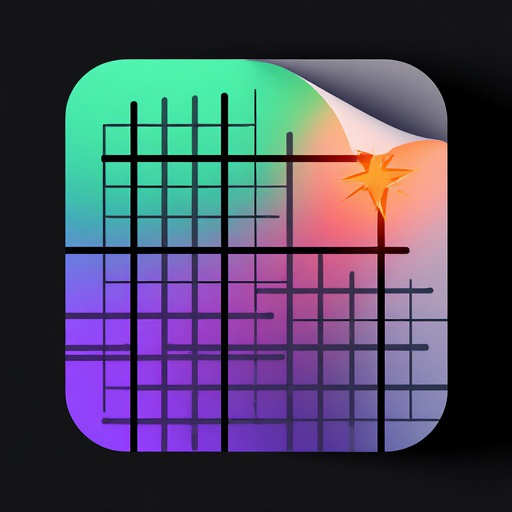

# 📝 Insait Text Editor

<div align="center">



**Intelligent Text Editor with Integrated Local AI Assistant**

[](https://dotnet.microsoft.com/)
[](https://avaloniaui.net/)
[](https://github.com/SciSharp/LLamaSharp)
[](LICENSE)
[](https://www.microsoft.com/windows)

[English](#english) | [Українська](#українська) | [Русский](#русский)

</div>

---

## 🌟 Key Features

### ✍️ Advanced Text Editor
- **Multi-tab interface** - work with multiple documents simultaneously
- **Rich text formatting** - support for bold, italic, underline, and mixed formatting
- **Smart word wrapping** - automatic line breaks at word boundaries
- **Ruled paper backgrounds** - lined, grid, and plain paper modes
- **Customizable styling** - adjust font size, colors, line spacing
- **Auto-save** - never lose your work with automatic session persistence
- **File associations** - double-click `.txt` files to open in Insait

### 🤖 Local AI Assistant (Offline)
- **100% Private & Offline** - all AI processing happens locally on your device
- **Microsoft Agent Framework** - built on enterprise-grade AI infrastructure
- **Gemma 3 1B Model** - efficient quantized model (Q2_K_XL) for fast responses
- **Context-aware conversations** - maintains conversation history and context
- **Reasoning chains** - transparent step-by-step thinking process
- **Long-term memory** - remembers facts and preferences across sessions
- **Streaming responses** - see AI responses generate in real-time
- **Tool integration** - save poems, search information, and more

### 🌍 Internationalization
- **5 Languages** - English, Ukrainian, Russian, German, Turkish
- **Easy language switching** - change UI language on the fly
- **Full RTL support** - proper rendering for right-to-left languages

### 🎨 Modern UI/UX
- **Fluent Design** - modern, clean interface following Microsoft Fluent guidelines
- **Custom window chrome** - frameless window with custom title bar
- **Smooth animations** - polished transitions and interactions
- **Keyboard shortcuts** - efficient keyboard-driven workflow
- **Context menus** - quick access to common operations

### 🔒 Privacy & Security
- **Local database** - all data stored locally using LiteDB
- **No internet required** - works completely offline
- **No telemetry** - zero data collection or tracking
- **User data control** - you own your data completely

---


## 🚀 Getting Started

### System Requirements

**Minimum:**
- **OS:** Windows 10 (64-bit) or Windows 11
- **RAM:** 4 GB
- **Storage:** 2 GB free space
- **CPU:** x64 processor with AVX2 support (Intel Core i5 4th gen or newer, AMD Ryzen)

**Recommended:**
- **OS:** Windows 11
- **RAM:** 8 GB or more
- **Storage:** 5 GB free space
- **CPU:** Modern multi-core processor (Intel Core i5 8th gen+, AMD Ryzen 3000+)

### Installation

#### Option 1: Microsoft Store
**[Download from Microsoft Store](https://apps.microsoft.com/store/detail/...)** *(In Certification)*


### First Launch

1. **Download AI Model** (if not included):
   - Model: `gemma-3-1b-it-UD-Q2_K_XL.gguf`
   - Place in: `InsaitTextEditor/AiModel/` folder
   - [Download Link](https://huggingface.co/...)

2. **Accept User Agreement**
   - Read and accept the terms on first launch

3. **Choose Language**
   - Select your preferred UI language

4. **Start Creating!**
   - Click "+" to create a new document
   - Press `Alt+K` to open AI chat

---

## 🎯 Usage Guide

### Basic Editing

| Action | Shortcut | Description |
|--------|----------|-------------|
| New Document | `Ctrl+N` | Create a new blank document |
| Open File | `Ctrl+O` | Open an existing `.txt` file |
| Save | `Ctrl+S` | Save current document |
| Save As | `Ctrl+Shift+S` | Save with a new name |
| Undo | `Ctrl+Z` | Undo last action |
| Redo | `Ctrl+Y` | Redo undone action |
| Select All | `Ctrl+A` | Select all text |
| Copy | `Ctrl+C` | Copy selection |
| Cut | `Ctrl+X` | Cut selection |
| Paste | `Ctrl+V` | Paste from clipboard |

### Text Formatting

| Action | Shortcut | Description |
|--------|----------|-------------|
| Bold | `Ctrl+B` | Toggle **bold** formatting |
| Italic | `Ctrl+I` | Toggle *italic* formatting |
| Underline | `Ctrl+U` | Toggle <u>underline</u> formatting |

**Formatting Syntax:**
- `**text**` - Bold
- `*text*` - Italic
- `<u>text</u>` - Underline

### AI Assistant

| Action | Shortcut | Description |
|--------|----------|-------------|
| Open Chat | `Alt+K` | Open AI chat window |
| Send Message | `Enter` | Send message to AI |
| Clear History | — | Reset conversation |

**AI Capabilities:**
- Answer questions about your text
- Generate creative content (poems, stories)
- Explain concepts and provide information
- Brainstorm ideas
- Check grammar and style
- Translate text (with context)

### Tab Management

| Action | Shortcut | Description |
|--------|----------|-------------|
| New Tab | Click `+` | Create a new document tab |
| Close Tab | Click `×` on tab | Close current tab |
| Switch Tabs | Click tab | Switch between open documents |
| Open in New Window | `Alt+T` | Open current tab in a new window |

---

## 🛠️ Technical Details

### Architecture

**Framework & UI:**
- **.NET 10.0** - Latest .NET platform
- **Avalonia UI 11.3** - Cross-platform XAML-based UI framework
- **MVVM Pattern** - Clean separation of concerns

**AI Engine:**
- **LLamaSharp 0.25.0** - C# bindings for llama.cpp
- **Gemma 3 1B** - Google's open-source language model
- **Microsoft Agent Framework** - Enterprise-grade AI orchestration
- **Quantization:** Q2_K_XL for optimal size/performance balance

**Data Storage:**
- **LiteDB 6.0** - Embedded NoSQL database for documents and chat history
- **Local file system** - All data stored locally

**Rendering:**
- **SkiaSharp** - High-performance 2D graphics
- **Custom text rendering** - Optimized for rich text and ruled backgrounds

### Project Structure

```
InsaitTextEditor/
├── Services/           # Core business logic
│   ├── AgentService.cs         # AI agent orchestration
│   ├── TabManager.cs           # Document tab management
│   ├── DatabaseService.cs      # Data persistence
│   ├── LocalizationService.cs  # Multi-language support
│   └── Memory/                 # AI long-term memory
├── Windows/            # UI windows
│   ├── ChatWindow.axaml        # AI chat interface
│   ├── SettingsWindow.axaml    # Settings dialog
│   └── ...
├── Controls/           # Custom UI controls
│   ├── LinedTextInput.axaml.cs # Rich text editor control
│   ├── TabsPanel.axaml.cs      # Tab strip control
│   └── ...
├── Models/             # Data models
├── AiModel/            # AI model files (GGUF)
└── Database/           # Local database files
```

---

## 🤝 Contributing

Contributions are welcome! Here's how you can help:

1. **Report Bugs** - Open an issue with detailed reproduction steps
2. **Suggest Features** - Share your ideas for improvements
3. **Submit Pull Requests** - Fix bugs or add features
4. **Improve Documentation** - Help make the docs better
5. **Translate** - Add support for more languages


### Code Style
- Follow C# coding conventions
- Use meaningful variable names
- Add XML documentation for public APIs
- Write unit tests for new features

---


## 🐛 Known Issues

### General
- ⚠️ First AI response may be slow (model loading) - subsequent responses are fast
- ⚠️ Large documents (>10 MB) may experience performance degradation

### Windows-specific
- ⚠️ Requires AVX2 CPU instruction set (most CPUs from 2014+)
- ⚠️ Windows Defender may flag first download (false positive) - click "More info" → "Run anyway"

### Workarounds
- If AI is slow: Close and reopen the chat window to reload the model
- If text rendering glitches: Resize the window or switch tabs

---


## 🙏 Acknowledgments

**Open Source Libraries:**
- [Avalonia](https://avaloniaui.net/) - Cross-platform UI framework
- [LLamaSharp](https://github.com/SciSharp/LLamaSharp) - C# bindings for llama.cpp
- [LiteDB](https://www.litedb.org/) - Embedded NoSQL database
- [SkiaSharp](https://github.com/mono/SkiaSharp) - 2D graphics library

**AI Models:**
- [Gemma](https://ai.google.dev/gemma) - Google's open-source language model
- [llama.cpp](https://github.com/ggerganov/llama.cpp) - Efficient LLM inference engine

**Microsoft:**
- [Microsoft Agent Framework](https://github.com/microsoft/agents) - AI orchestration platform

---

## 📄 License

This project is licensed under the **MIT License** - see the [LICENSE](LICENSE) file for details.

```
MIT License

Copyright (c) 2025 Insait Text Editor

Permission is hereby granted, free of charge, to any person obtaining a copy
of this software and associated documentation files (the "Software"), to deal
in the Software without restriction, including without limitation the rights
to use, copy, modify, merge, publish, distribute, sublicense, and/or sell
copies of the Software, and to permit persons to whom the Software is
furnished to do so, subject to the following conditions:

The above copyright notice and this permission notice shall be included in all
copies or substantial portions of the Software.

THE SOFTWARE IS PROVIDED "AS IS", WITHOUT WARRANTY OF ANY KIND, EXPRESS OR
IMPLIED, INCLUDING BUT NOT LIMITED TO THE WARRANTIES OF MERCHANTABILITY,
FITNESS FOR A PARTICULAR PURPOSE AND NONINFRINGEMENT.
```

---


<div align="center">

**Made with ❤️ by the developer**

If you find this project useful, please consider giving it a ⭐ on GitHub!

[⬆ Back to Top](#-insait-text-editor)

</div>

---

# Українська

## 📝 Insait Text Editor - Інтелектуальний текстовий редактор з вбудованим локальним AI асистентом

### 🌟 Основні можливості

**Розширений текстовий редактор:**
- Багатовкладковий інтерфейс для роботи з кількома документами
- Підтримка форматованого тексту (жирний, курсив, підкреслення)
- Розумне перенесення слів на межах слів
- Лінійований папір, сітка та звичайний фон
- Налаштування шрифтів, кольорів, міжрядкового інтервалу
- Автозбереження - ніколи не втрачайте свою роботу

**Локальний AI асистент (офлайн):**
- 100% приватність - вся обробка локально на вашому пристрої
- Базується на Microsoft Agent Framework
- Модель Gemma 3 1B для швидких відповідей
- Підтримка контексту розмови
- Ланцюжки міркувань - прозорий процес мислення AI
- Довготривала пам'ять - запам'ятовує факти між сесіями

**Інтернаціоналізація:**
- 5 мов: англійська, українська, російська, німецька, турецька
- Легке перемикання мови в інтерфейсі

### 📥 Встановлення

#### Microsoft Store
**[Завантажити з Microsoft Store](https://apps.microsoft.com/store/detail/...)** *(На сертифікації)*

#### GitHub Release
1. Завантажте останній реліз з [Releases](https://github.com/YourUsername/InsaitTextEditor/releases)
2. Запустіть інсталятор
3. Дотримуйтесь інструкцій на екрані

### 🎯 Швидкий старт

- `Ctrl+N` - новий документ
- `Ctrl+O` - відкрити файл
- `Ctrl+S` - зберегти
- `Alt+K` - відкрити чат з AI
- `**текст**` - жирний
- `*текст*` - курсив
- `<u>текст</u>` - підкреслення

---

# Русский

## 📝 Insait Text Editor - Интеллектуальный текстовый редактор со встроенным локальным AI ассистентом

### 🌟 Основные возможности

**Расширенный текстовый редактор:**
- Многовкладочный интерфейс для работы с несколькими документами
- Поддержка форматированного текста (жирный, курсив, подчёркивание)
- Умный перенос слов на границах слов
- Линованная бумага, сетка и обычный фон
- Настройка шрифтов, цветов, межстрочного интервала
- Автосохранение - никогда не теряйте свою работу

**Локальный AI ассистент (офлайн):**
- 100% приватность - вся обработка локально на вашем устройстве
- Основан на Microsoft Agent Framework
- Модель Gemma 3 1B для быстрых ответов
- Поддержка контекста разговора
- Цепочки рассуждений - прозрачный процесс мышления AI
- Долговременная память - запоминает факты между сессиями

**Интернационализация:**
- 5 языков: английский, украинский, русский, немецкий, турецкий
- Лёгкое переключение языка в интерфейсе

### 📥 Установка

#### Microsoft Store
**[Скачать из Microsoft Store](https://apps.microsoft.com/store/detail/...)** *(На сертификации)*

#### GitHub Release
1. Загрузите последний релиз с [Releases](https://github.com/YourUsername/InsaitTextEditor/releases)
2. Запустите установщик
3. Следуйте инструкциям на экране

### 🎯 Быстрый старт

- `Ctrl+N` - новый документ
- `Ctrl+O` - открыть файл
- `Ctrl+S` - сохранить
- `Alt+K` - открыть чат с AI
- `**текст**` - жирный
- `*текст*` - курсив
- `<u>текст</u>` - подчёркивание

---

<div align="center">

**Создано с ❤️ разработчиком**

Если этот проект полезен для вас, пожалуйста, поставьте ⭐ на GitHub!

</div>


